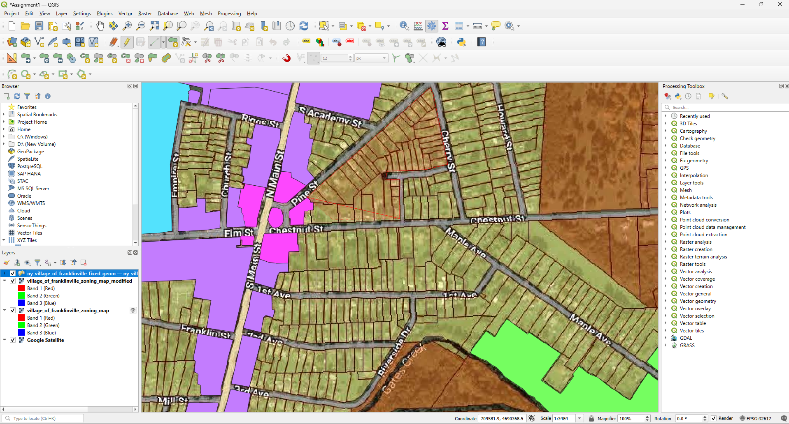
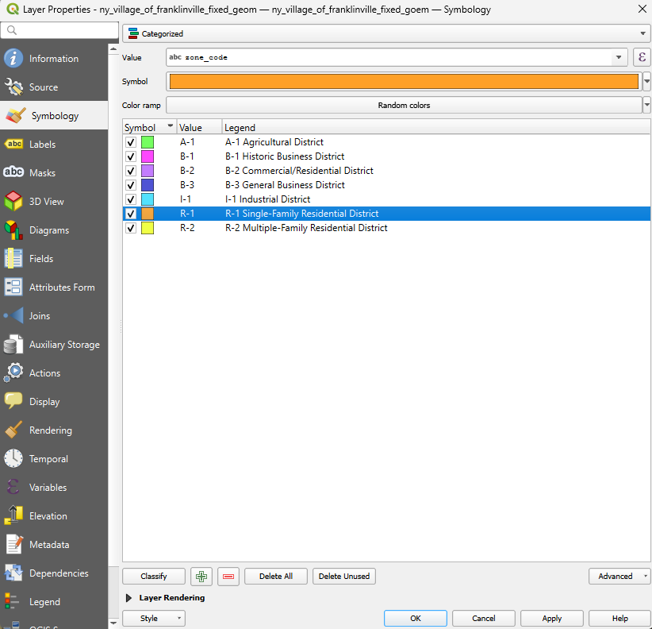

# 01 — Village of Franklinville, NY: Zoning Map Digitization & Georeferencing

Georeferencing and vector digitization of the Village of Franklinville's
scanned zoning map, converting a static raster document with no coordinate
reference system into an accurate, attributed GIS layer.


## Project summary

| | |
|---|---|
| **Location** | Village of Franklinville, Cattaraugus County, New York, USA |
| **Source document** | Scanned zoning map, JPEG, no embedded CRS |
| **Target CRS** | EPSG:32617 — WGS 84 / UTM Zone 17N |
| **Georeferencing** | 3 GCPs, Polynomial 1 transformation, ~0 mean error |
| **Digitized features** | 77 polygons across 7 zoning classes |
| **Software** | QGIS (XYZ Tiles, Georeferencer, Digitizing toolbar, Symbology) |

---

## Step 1 — Add a live satellite basemap for reference

Before touching the source document, I added Google Satellite imagery as an
**XYZ Tiles** layer in QGIS so I'd have a real-world reference to align
against later:

1. In the **Browser** panel, right-click **XYZ Tiles → New Connection**.
2. Name it `Google Satellite` and paste the tile URL:
   `https://mt1.google.com/vt/lyrs=s&x={x}&y={y}&z={z}`
3. Click OK, then double-click the new connection to load it into the map.

This basemap is what every GCP and every digitized boundary was ultimately
checked against.

## Step 2 — Determine the correct UTM zone

The scanned zoning map had no coordinate system at all, so before it could
be georeferenced I needed to know which projected CRS actually applies to
Franklinville:

1. Looked up "Village of Franklinville, NY" in **Google Maps** to get its
   approximate location.
2. Opened **Google Earth Pro**, enabled UTM coordinate display
   (**Tools → Options → 3D View → Show Lat/Long as → Universal Transverse
   Mercator**), and dropped a placemark on the village center.
3. Read off the UTM zone from the placemark's coordinates — **Zone 17N**,
   confirming **EPSG:32617 (WGS 84 / UTM Zone 17N)** as the target CRS.

## Step 3 — Georeference the source raster

With the target CRS known, I opened QGIS's **Georeferencer** tool
(`Layer → Georeferencer`) and loaded the raw scan
(`source/village_of_franklinville_zoning_map.jpg`):

1. Set the **Target CRS** to EPSG:32617 in the Georeferencer settings.
2. Placed **3 Ground Control Points (GCPs)**, each time clicking a
   recognizable feature on the scanned map (a road intersection or block
   corner) and then clicking the matching real-world location on the
   Google Satellite basemap, entering its map coordinates.
3. Set **Transformation type** to **Polynomial 1** (a straightforward
   affine transform, appropriate given the source map's regular, undistorted
   layout).
4. Ran the transformation. The resulting **mean error was effectively 0**,
   meaning the 3 GCPs were highly consistent with each other and the source
   map aligned cleanly onto real-world coordinates.
5. Exported the result as a georeferenced GeoTIFF —
   (`georeferencing/village_of_franklinville_zoning_map_modified.tif`) — and
   saved the GCP set as (`georeferencing/village_of_franklinville_zoning_map_GCPs.points`).

 & Transformation settings).png)

## Step 4 — Digitize zoning boundaries

With the raster now accurately placed in real-world space, I created a new
**GeoPackage** layer (`vector/ny_village_of_franklinville.gpkg`)
with **MultiPolygon** geometry in EPSG:32617, and began tracing zoning
boundaries directly over the aligned raster:

1. **Add Polygon Feature tool** — traced each individual zoning parcel/block
   as its own polygon directly over the raster, one feature at a time,
   rather than tracing one large boundary and dividing it up afterward.
2. **Snapping (Magnet mode)** — kept snapping enabled throughout so that
   every new polygon's edges locked precisely onto the shared edges of
   polygons already digitized next to it.
3. **Topology checking** — enabled alongside snapping to actively prevent
   overlaps or gaps from forming between adjacent zoning polygons as each
   new one was added.
4. **Tracing mode** — used to trace along existing digitized edges when a
   new polygon shared a boundary with one already drawn, instead of
   re-clicking every shared vertex by hand.
5. **Vertex tool** — used at the end to fine-tune individual vertices where
   a boundary needed to hug the raster more precisely.



## Step 5 — Research the zoning ordinance and attribute every feature

Before filling in attributes, I researched Franklinville's actual zoning
ordinance so that the zone codes on the scanned map (abbreviations like
`R-1`, `B-2`) were paired with their **correct, official district names**
rather than guessed. Each of the 77 digitized polygons was then attributed
with:

| Field | Description |
|---|---|
| `fid` | Auto-generated GeoPackage feature ID |
| `id` | Sequential feature identifier |
| `vector_shp` | Geometry type label (Polygon) |
| `town` | Village/city/town name — Franklinville |
| `zone_code` | Official zoning code per the ordinance (e.g. `R-1`, `B-2`) |
| `zone_name` | Full official district name per the ordinance |

Populated attribute table showing zone_code and zone_name for all 77 features (images/3.Attribute Table.png)

**Zoning classification results:**

| Zone Code | District Name | Feature Count |
|---|---|---|
| A-1 | Agricultural District | 3 |
| B-1 | Historic Business District | 6 |
| B-2 | Commercial/Residential District | 21 |
| B-3 | General Business District | 4 |
| I-1 | Industrial District | 7 |
| R-1 | Single-Family Residential District | 9 |
| R-2 | Multiple-Family Residential District | 27 |
| **Total** | | **77** |

## Step 6 — Symbolize and export the final map

1. Opened **Layer Properties → Symbology**, set the renderer to
   **Categorized**, and set the classification field to `zone_code`.
2. Clicked **Classify** to auto-generate one symbol per unique zone code,
   then assigned distinct, legend-friendly colors to each of the 7 classes.
3. Saved this styling separately as
   `vector/ny_village_of_franklinville_fixed_geom_style.qml` so it can be
   reloaded onto the layer independently of the GeoPackage itself.
4. Composited the styled layer over the Google Satellite basemap in the
   **Print Layout**, added a title, legend, north arrow, and scale bar, and
   exported the final map as `outputs/Final_Georef_Dig_Map.png`.



---

## Repository contents

```
01-village_of_franklinville/
├── source/            # Original scanned zoning map (no CRS)
│   └── village_of_franklinville_zoning_map.jpg
├── georeferencing/     # GCP file + georeferenced GeoTIFF (EPSG:32617)
│   ├── village_of_franklinville_zoning_map_GCPs.points
│   └── village_of_franklinville_zoning_map_modified.tif
├── vector/             # Final GeoPackage + QGIS style file
│   ├── ny_village_of_franklinville.gpkg
│   └── ny_village_of_franklinville_style.qml
├── outputs/            # Final cartographed map (PNG)
│   └── ny_village_of_franklinville_finalmap2.png
├── images/             # Workflow screenshots referenced in this README
└── README.md
```

## Tools & skills demonstrated
QGIS XYZ Tiles & Georeferencer · manual GCP collection · UTM zone
determination via Google Earth Pro · Polynomial transformation · topological
vector digitization (split/ring/snapping tools) · GeoPackage data modeling ·
zoning ordinance research & attribute schema design · categorized
cartographic symbology · print layout composition
