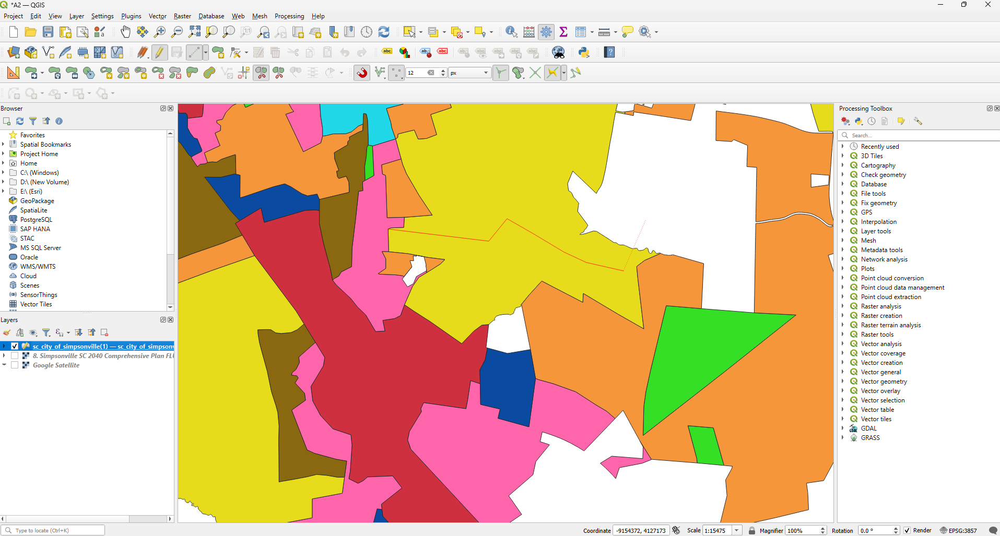
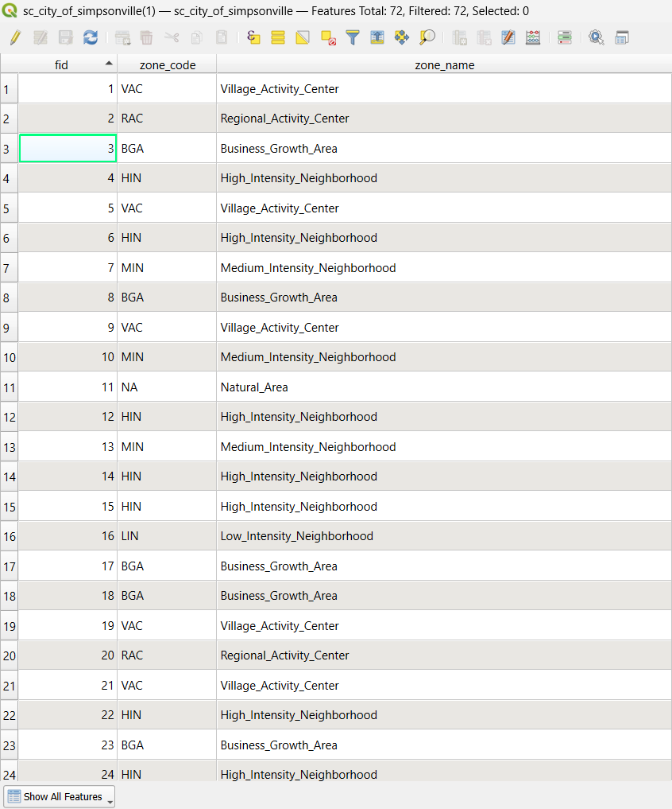
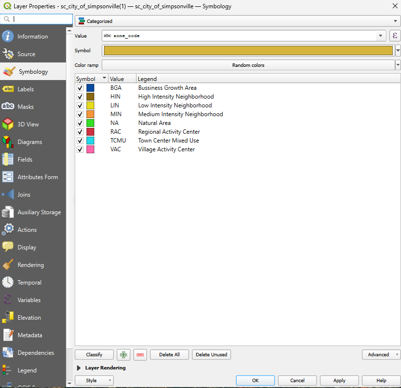

# 02 — City of Simpsonville, SC: Future Land Use Map Digitization

Digitization of the City of Simpsonville's **2040 Comprehensive Plan Future
Land Use Map (FLUM)** — a published planning PDF that was already
georeferenced when loaded into QGIS, so this case study skips the manual
GCP/Georeferencer stage entirely and goes straight from source PDF to
digitized, attributed vector layer.

> **Note:** this source document classifies land by planning **land-use
> intensity/activity categories** (e.g. Low/Medium/High-Intensity
> Neighborhood, Regional Activity Center), not by zoning ordinance codes
> like Franklinville's R-1/B-2. It's digitizing a Future Land Use Map, not
> a zoning map — kept in this series because the GIS workflow (raster →
> digitized, attributed vector) is identical.

_final_image.png)

## Project summary

| | |
|---|---|
| **Location** | City of Simpsonville, South Carolina, USA |
| **Source document** | *Simpsonville SC 2040 Comprehensive Plan — Future Land Use Map*, PDF |
| **Georeferencing** | None required — PDF loaded already georeferenced |
| **Layer CRS** | EPSG:4326 — WGS 84 (geographic) |
| **Digitized features** | 72 polygons across 8 land-use classes |
| **Software** | QGIS (Digitizing toolbar, Symbology) |

---

## Step 1 — Load the source PDF directly

Unlike Franklinville, this source document is a **georeferenced PDF** —
opening it directly in QGIS placed it correctly in real-world space right
away, with no GCP collection or Georeferencer step needed. I confirmed the
alignment by comparing it against the Google Satellite basemap (added the
same way as before, via **XYZ Tiles**) before starting to digitize.

## Step 2 — Digitize land-use boundaries

I created a new **GeoPackage** layer (`vector/sc_city_of_simpsonville(1).gpkg`)
with **MultiPolygon** geometry, and digitized directly over the loaded PDF
using the same boundary-trace-then-split-and-ring method as the rest of this
series:

1. **Boundary tracing** — drew the outer city limit first as a single large
   polygon, following the "City Limits" outline already shown on the source
   map.
2. **Split tool** — divided that outer boundary into individual land-use
   parcels by drawing split lines along the category boundaries visible in
   the source PDF's shading.
3. **Ring tool** — used for land-use areas that sit entirely inside another
   polygon's boundary, where a split line would otherwise have to exit the
   parent shape.
4. **Snapping + topology checking + tracing** — kept all three enabled
   throughout so adjacent polygon edges matched exactly, avoiding slivers,
   gaps, or overlaps between neighboring land-use areas.
5. **Vertex tool** — used to fine-tune vertices where a boundary needed to
   hug the source PDF's shading more precisely.



## Step 3 — Attribute each feature

Because this source PDF has its own printed legend (unlike a zoning map,
which requires cross-referencing an external ordinance), each polygon's
classification came directly from matching its shading against that legend.
Each of the 72 polygons was attributed with:

| Field | Description |
|---|---|
| `fid` | Auto-generated GeoPackage feature ID |
| `zone_code` | Abbreviated land-use code (e.g. `MIN`, `VAC`, `RAC`) |
| `zone_name` | Full land-use category name matching the source map's legend |



**Land-use classification results:**

| Zone Code | Category | Feature Count |
|---|---|---|
| BGA | Business Growth Area | 8 |
| HIN | High-Intensity Neighborhood | 13 |
| LIN | Low-Intensity Neighborhood | 6 |
| MIN | Medium-Intensity Neighborhood | 20 |
| NA | Natural Area | 7 |
| RAC | Regional Activity Center | 3 |
| TCMU | Town Center Mixed Use | 1 |
| VAC | Village Activity Center | 14 |
| **Total** | | **72** |

## Step 4 — Symbolize and export the final map

1. Opened **Layer Properties → Symbology**, set the renderer to
   **Categorized**, and set the classification field to `zone_code`.
2. Clicked **Classify** to auto-generate one symbol per unique code, then
   matched each color to the source PDF's own legend colors as closely as
   possible for consistency with the original.
3. Saved the styling separately as
   `vector/sc_city_of_simpsonville(1)__symbology.qml`.
4. Composited the styled layer over satellite imagery and exported the
   final map, including the source map's own title block and logo
   alongside the digitized layer, as
   `outputs/sc_city_of_simpsonville(1)__final_image.png`.



---

## Repository contents

```
02-sc_city_of_simpsonville/
├── source/            # Original Comprehensive Plan FLUM (already georeferenced PDF)
│   └── 8__Simpsonville_SC_2040_Comprehensive_Plan_FLUM_Updated_2025.pdf
├── vector/             # Final GeoPackage + QGIS style file
│   ├── sc_city_of_simpsonville(1)_.gpkg
│   └── sc_city_of_simpsonville(1)__symbology.qml
├── outputs/            # Final cartographed map (PNG)
│   └── sc_city_of_simpsonville(1)__final_image.png
├── images/             # Workflow screenshots referenced in this README
└── README.md
```

## Tools & skills demonstrated
QGIS digitizing toolbar (boundary tracing, split, ring, snapping, topology
checking, vertex editing) · GeoPackage data modeling · source-legend-based
attribute classification · categorized cartographic symbology matched to a
published reference map
